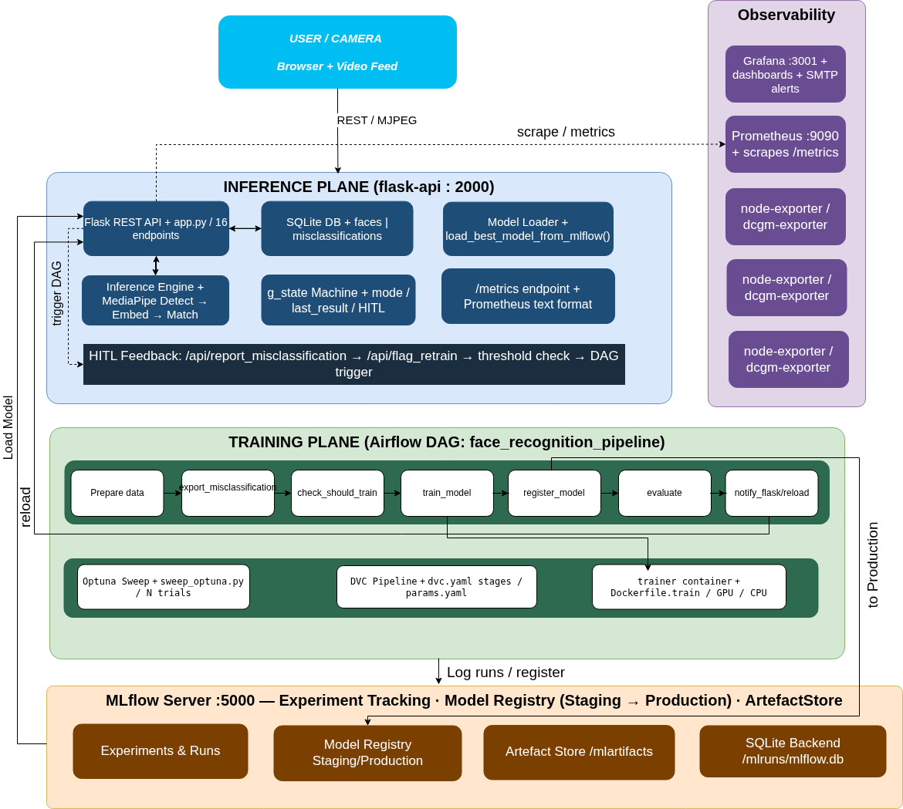
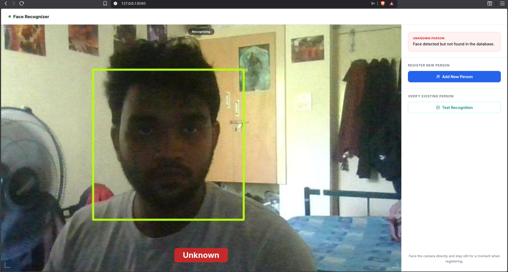
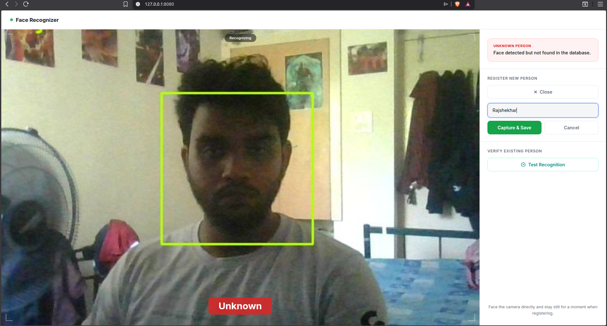
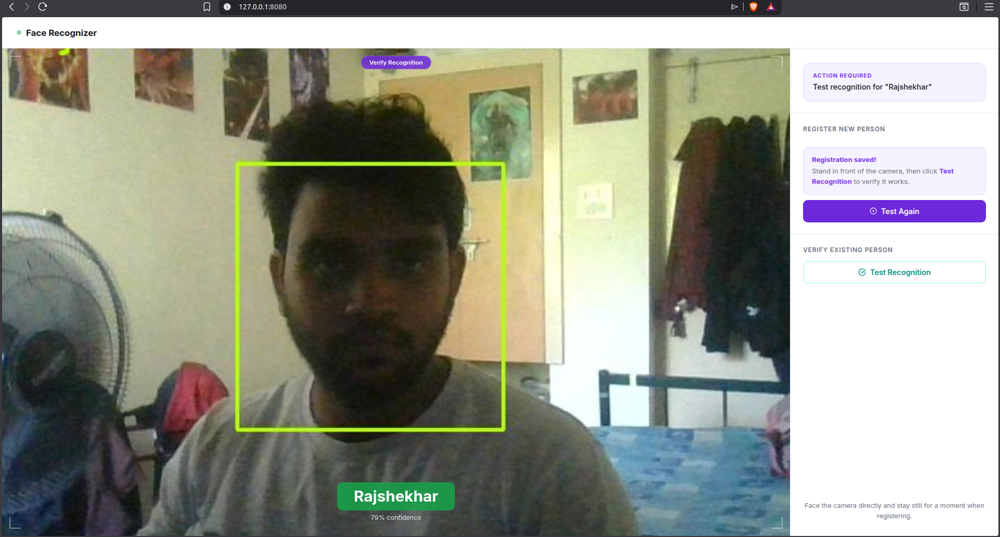
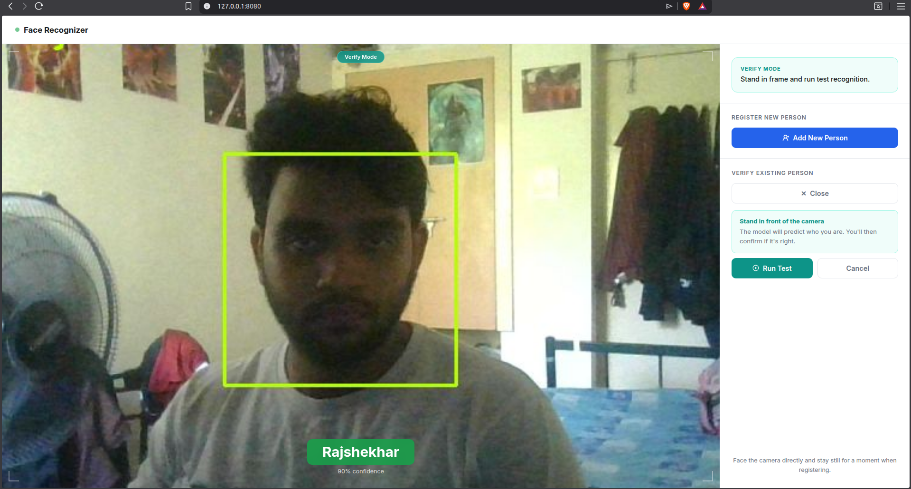

# 🎭 Face Recognition MLOps System

> **A production-grade, end-to-end MLOps pipeline for real-time face recognition — with automated retraining, human-in-the-loop feedback, experiment tracking, and full observability.**

[](https://docs.docker.com/compose/)
[](https://airflow.apache.org/)
[](https://mlflow.org/)
[](https://pytorch.org/)
[](https://flask.palletsprojects.com/)
[](https://prometheus.io/)
[](https://grafana.com/)

---

## 📋 Table of Contents

1. [System Overview](#1-system-overview)
2. [Architecture](#2-architecture)
3. [Prerequisites & System Requirements](#3-prerequisites--system-requirements)
4. [Repository Setup](#4-repository-setup)
5. [Required Configuration Files](#5-required-configuration-files)
6. [Dataset Download](#6-dataset-download)
7. [Building & Starting All Services](#7-building--starting-all-services)
8. [Running the Training Pipeline](#8-running-the-training-pipeline) — DVC (manual) & Airflow (automated)
9. [Using the Live Camera Application](#9-using-the-live-camera-application)
10. [Monitoring with Grafana & Prometheus](#10-monitoring-with-grafana--prometheus)
11. [Project Structure](#11-project-structure)
12. [Configuration Reference](#12-configuration-reference)
13. [Running Tests](#13-running-tests)
14. [Troubleshooting](#14-troubleshooting)
15. [Glossary](#15-glossary)

---

## 1. System Overview

This system implements a **Siamese Neural Network** for real-time face recognition via webcam, wrapped in a complete MLOps lifecycle:

| Component | Role |
|---|---|
| **Flask API** | Live camera feed, face registration, inference, HITL feedback |
| **DVC** | Primary way to run training manually — `dvc repro` executes the full pipeline with stage caching |
| **Apache Airflow** | Automated retraining loop — triggered on a weekly schedule or manually; only retrains when misclassifications exist |
| **MLflow** | Experiment tracking, model registry (Staging → Production) |
| **Optuna** | Hyperparameter search during training |
| **Prometheus + Grafana** | Metrics scraping, dashboards, and SMTP alerting |

**Key capabilities:**
- Register faces live through your webcam in real time
- Siamese network with triplet-loss produces compact 128-dim face embeddings
- **Manual training** via `dvc repro` — edit `params.yaml`, run `dvc repro`, done
- **Automated retraining** via Airflow — weekly schedule or manual trigger; skips training if no misclassifications exist
- Seamless hot-reload: the API automatically pulls the new Production model without restarting
- Full GPU support with NVIDIA Container Toolkit; CPU fallback available

---

## 2. Architecture

The diagram below shows how all components connect — from the browser/camera all the way through the inference plane, training plane, and down to MLflow's model registry and artifact store.



**Flow summary:**

```
User / Camera (Browser + MJPEG)
        │
        ▼
Inference Plane ─────────────────── Flask API :2000
  ├─ MediaPipe face detection
  ├─ Siamese embedding + nearest-neighbour match
  ├─ SQLite DB (registered faces + misclassifications)
  ├─ HITL feedback → /api/report_misclassification
  └─ Triggers Airflow DAG when misclassification count ≥ threshold
        │
        ▼
Training Plane ──────────────────── Airflow DAG: face_recognition_pipeline
  ├─ prepare_data  →  export_misclassified  →  check_should_train
  ├─ train_model (Optuna sweep, DVC pipeline, trainer container / GPU)
  ├─ register_model  →  evaluate_and_promote
  └─ notify_flask / reload  →  api_health_check
        │
        ▼
MLflow Server :5000 ─────────────── Experiment Tracking · Model Registry · Artifact Store
        │
        └──► Flask API hot-reloads new Production model automatically
```

---

## 3. Prerequisites & System Requirements

### 3.1 Hardware Requirements

| Component | Minimum | Recommended |
|---|---|---|
| GPU | NVIDIA with 6 GB VRAM (CUDA 12.1) | NVIDIA RTX 3080 / A100 |
| RAM | 16 GB | 32 GB |
| Disk space | 50 GB free | 100 GB free |
| CPU cores | 4 cores | 8+ cores |
| Internet | Required (dataset + Docker images) | Broadband |
| Webcam | USB or built-in (`/dev/video0`) | HD 1080p |

### 3.2 Software to Install

**A. Docker Engine & Docker Compose v2**

```bash
# Ubuntu / Debian
sudo apt-get update
sudo apt-get install -y ca-certificates curl gnupg
sudo install -m 0755 -d /etc/apt/keyrings
curl -fsSL https://download.docker.com/linux/ubuntu/gpg \
  | sudo gpg --dearmor -o /etc/apt/keyrings/docker.gpg
echo "deb [arch=$(dpkg --print-architecture) signed-by=/etc/apt/keyrings/docker.gpg] \
https://download.docker.com/linux/ubuntu $(. /etc/os-release && echo $VERSION_CODENAME) stable" \
  | sudo tee /etc/apt/sources.list.d/docker.list > /dev/null
sudo apt-get update
sudo apt-get install -y docker-ce docker-ce-cli containerd.io docker-compose-plugin

# Add yourself to the docker group (log out and back in after this)
sudo usermod -aG docker $USER
```

**B. NVIDIA Container Toolkit** *(lets Docker containers access your GPU)*

```bash
curl -fsSL https://nvidia.github.io/libnvidia-container/gpgkey \
  | sudo gpg --dearmor -o /usr/share/keyrings/nvidia-container-toolkit-keyring.gpg
curl -s -L https://nvidia.github.io/libnvidia-container/stable/deb/nvidia-container-toolkit.list \
  | sed 's#deb https://#deb [signed-by=/usr/share/keyrings/nvidia-container-toolkit-keyring.gpg] https://#g' \
  | sudo tee /etc/apt/sources.list.d/nvidia-container-toolkit.list
sudo apt-get update && sudo apt-get install -y nvidia-container-toolkit
sudo nvidia-ctk runtime configure --runtime=docker
sudo systemctl restart docker
```

**C. Git**

```bash
sudo apt-get install -y git
```

### 3.3 Verify Your Installation

```bash
docker --version          # e.g. Docker version 25.0.3
docker compose version    # e.g. Docker Compose version v2.24.5
nvidia-smi                # lists your GPU and driver version
git --version             # e.g. git version 2.43.0
```

> **Tip:** If `docker` fails with `permission denied`, log out and back in — the group change requires a fresh session.

---

## 4. Repository Setup

```bash
# Navigate to where you want the project (needs 50 GB+ free)
cd ~/projects

# Clone the repository
git clone https://github.com/DextroLaev/DA5402-MLOPS---Final-Project.git

# Enter the project directory — ALL subsequent commands run from here
cd DA5402-MLOPS---Final-Project
```

After cloning, verify with `ls`. You should see:

```
DA5402-MLOPS---Final-Project/
├── src/                    ← Python source (model, training, utils)
├── flask_app/              ← Web camera application
├── dags/                   ← Airflow pipeline DAG
├── scripts/                ← Helper shell scripts
├── monitoring/             ← Prometheus & Grafana config
├── data/                   ← Dataset goes here
├── checkpoints/            ← Saved model weights (auto-created)
├── logs/                   ← Training logs (auto-created)
├── docker-compose.yaml     ← Defines all services
├── params.yaml             ← Training hyperparameters
├── dvc.yaml                ← DVC pipeline stages
├── requirements.txt        ← Python dependencies
├── Dockerfile.train        ← Trainer container
├── Dockerfile.api          ← Flask API container
└── Dockerfile.airflow      ← Airflow container
```

---

## 5. Required Configuration Files

> ⚠️ **Do NOT skip this section.** These files contain secrets and configuration Docker needs at startup. Missing any one of them will prevent the stack from starting.

### 5.1 The `.env` File

Create a file named `.env` in the project root (same directory as `docker-compose.yaml`):

```bash
nano .env
```

Paste the following content, edit the values for your environment, then save (`Ctrl+O`, `Ctrl+X`):

```dotenv
# ── Local vs Remote Training ────────────────────────────────────────
# false = train on THIS machine (GPU required)
# true  = SSH into a separate GPU server for training
RUN_REMOTE=false

# Docker network name — keep as-is unless Docker warns about it
COMPOSE_NETWORK=da5402mlops-final-project_mlops-net

# ── Remote Server Settings (only needed if RUN_REMOTE=true) ─────────
REMOTE_SSH_USER=your_username          # e.g. ubuntu
REMOTE_SSH_HOST=192.168.1.100          # IP of your GPU server
REMOTE_MLFLOW_URI=http://192.168.1.100:5000
REMOTE_CODE_DIR=/home/your_username/code
REMOTE_DATA_DIR=/home/your_username/data

# ── MLflow Model Name ────────────────────────────────────────────────
MLFLOW_MODEL_NAME=SiameseFaceRecognition

# ── Airflow User ID (keeps file permissions correct on Linux) ────────
AIRFLOW_UID=50000
```

| Variable | Description |
|---|---|
| `RUN_REMOTE` | `false` = local GPU. `true` = SSH to remote GPU server. |
| `COMPOSE_NETWORK` | Docker internal network name. Leave as default. |
| `REMOTE_SSH_USER` | Username on the remote GPU server. Only needed when `RUN_REMOTE=true`. |
| `REMOTE_SSH_HOST` | IP / hostname of the remote server. Only needed when `RUN_REMOTE=true`. |
| `MLFLOW_MODEL_NAME` | Registry name in MLflow. Keep as `SiameseFaceRecognition`. |
| `AIRFLOW_UID` | Airflow's internal Linux UID. Keep at `50000`. |

### 5.2 SSH Key Setup *(Remote training only)*

Skip this if `RUN_REMOTE=false`.

```bash
# Generate an SSH key pair (press Enter at each prompt for defaults)
ssh-keygen -t rsa -b 4096 -C 'airflow-training'

# Copy the public key to your remote server
ssh-copy-id -i ~/.ssh/id_rsa.pub your_username@192.168.1.100

# Test passwordless login
ssh your_username@192.168.1.100 'echo SSH works!'
```

> The `docker-compose.yaml` mounts `~/.ssh/id_rsa` into the Airflow containers automatically.

### 5.3 `simple_auth_manager_passwords.json`

Airflow 3 stores hashed user passwords in a JSON file. Create it in the project root:

```bash
pip install bcrypt --quiet

python3 -c "
import bcrypt, json
password = b'airflow'
hashed = bcrypt.hashpw(password, bcrypt.gensalt()).decode()
data = {'airflow': hashed}
with open('simple_auth_manager_passwords.json', 'w') as f:
    json.dump(data, f, indent=2)
print('File created successfully')
"
```

This creates the login credentials: **username:** `airflow` | **password:** `airflow`.

> 🔒 **Security tip:** Change `b'airflow'` to a strong password before any real deployment, and update `AIRFLOW__CORE__SIMPLE_AUTH_MANAGER_USERS` in `docker-compose.yaml` to match.

### 5.4 Monitoring Configuration

```bash
mkdir -p monitoring/grafana

# Create Prometheus scrape config
cat > monitoring/prometheus.yaml << 'EOF'
global:
  scrape_interval: 15s

scrape_configs:
  - job_name: 'flask-api'
    static_configs:
      - targets: ['flask-api:2000']

  - job_name: 'node-exporter'
    static_configs:
      - targets: ['node-exporter:9100']

  - job_name: 'dcgm-exporter'
    static_configs:
      - targets: ['dcgm-exporter:9400']
EOF

# Create empty Grafana config (uses defaults)
touch monitoring/grafana/grafana.ini
```

---

## 6. Dataset Download

This project uses the **Labeled Faces in the Wild (LFW)** dataset (~200 MB).

```bash
mkdir -p data
cd data

# Download
wget http://vis-www.cs.umass.edu/lfw/lfw.tgz
# Or, if wget is unavailable:
# curl -L http://vis-www.cs.umass.edu/lfw/lfw.tgz -o lfw.tgz

# Extract
tar -xzf lfw.tgz

# Verify — should show ~5,749 identity folders
ls lfw/ | wc -l

cd ..
```

After extraction, the structure should be:

```
data/
└── lfw/
    ├── Aaron_Eckhart/
    │   └── Aaron_Eckhart_0001.jpg
    ├── Aaron_Guiel/
    │   └── Aaron_Guiel_0001.jpg
    └── ...  (5,749 folders total)
```

---

## 7. Building & Starting All Services

The first build downloads base images and compiles all custom containers — **allow 10–20 minutes**.

### 7.1 Build Docker Images

```bash
# Make sure you're in the project root
pwd   # should end with DA5402-MLOPS---Final-Project

docker compose build
```

### 7.2 Start the Full Stack

```bash
# Start all services in the background
docker compose up -d

# Make sure to do the following things to deal with permission issues
sudo chown -R 50000:0 ./data && sudo chmod -R 775 ./data
sudo chown -R 50000:0 ./checkpoints && sudo chmod -R 775 ./checkpoints
sudo chown -R 50000:0 ./logs && sudo chmod -R 775 ./logs

# Stream logs to watch startup (Ctrl+C to stop watching — services keep running)
docker compose logs -f --tail=50
```

> **Note:** On first run, `airflow-init` runs database migrations before the webserver starts. This takes 1–2 minutes and is normal.

### 7.3 Verify All Services Are Healthy

After ~2 minutes:

```bash
docker compose ps
```

Expected output:

```
NAME                    STATUS              PORTS
postgres                running             5432/tcp
mlflow                  running             0.0.0.0:5000->5000/tcp
airflow-webserver       healthy             0.0.0.0:8081->8080/tcp
airflow-scheduler       running
airflow-dag-processor   running
flask-api               healthy             0.0.0.0:8080->2000/tcp
prometheus              running             0.0.0.0:9090->9090/tcp
grafana                 running             0.0.0.0:3001->3000/tcp
```

### 7.4 Service URLs

| Service | URL | Default Login |
|---|---|---|
| 🎭 Flask API (camera app) | http://localhost:8080 | No login needed |
| 🌀 Airflow (pipeline control) | http://localhost:8081 | `airflow` / `airflow` |
| 📊 MLflow (experiment tracking) | http://localhost:5000 | No login needed |
| 📈 Prometheus (metrics) | http://localhost:9090 | No login needed |
| 📉 Grafana (dashboards) | http://localhost:3001 | `admin` / `admin` |

---

## 8. Running the Training Pipeline

There are **two distinct ways** training is triggered in this system. Understanding the difference is important before you start.

---

### 8A. Running Training Manually with DVC

**DVC (`dvc repro`) is the only way to run training directly from your terminal.** It executes the full pipeline — data preparation, model training, and MLflow registration — in a reproducible, stage-cached way. Only stages whose inputs have changed since the last run will be re-executed.

#### Step 1 — Edit hyperparameters in `params.yaml`

`params.yaml` is the **single source of truth** for all training configuration. Open it and change whatever you need before running:

```bash
nano params.yaml   # or open in your editor of choice
```

Key parameters to tune:

```yaml
prepare:
  dataset_name: lfw        # Dataset folder inside data/
  train_ratio: 0.70        # Fraction of data used for training
  seed: 42

train:
  n_trials: 1              # Number of Optuna hyperparameter trials
  n_epochs_per_trial: 20   # Epochs per trial
  batch_size: 32           # Reduce to 16 or 8 if you hit OOM errors
  embedding_dim: 128
  lr_min: 1e-5
  lr_max: 1e-5
  margin_min: 0.5
  margin_max: 0.5
  dropout_rate: 0.3
  warmup_epochs: 6
```

Save the file. DVC detects any change to `params.yaml` and will re-run the affected downstream stages automatically.

#### Step 2 — Run the pipeline

```bash
dvc repro
```

DVC runs the following stages in order:

| Stage | What it does | Duration |
|---|---|---|
| `prepare_data` | Validates the dataset, computes baseline stats, splits into train/val/test | 1–3 min |
| `train` | Runs Optuna sweep, trains the Siamese network, logs runs to MLflow | 20–120 min |
| `register` | Registers the best checkpoint in MLflow and moves it to Staging | < 1 min |

> **Tip:** If only `params.yaml` changed under `train:`, DVC skips `prepare_data` and goes straight to `train`. This saves time on iterative experiments.

#### Step 3 — Check results in MLflow

```bash
# MLflow UI
open http://localhost:5000
```

Go to **Models → SiameseFaceRecognition**. After `dvc repro` completes you should see a new version in **Staging**. To manually promote it to **Production**, click the version and change its stage — or let Airflow do it automatically (see below).

---

### 8B. Automated Pipeline via Airflow

The **Airflow DAG `face_recognition_pipeline`** does **not** run training unconditionally. It is designed for the **automated retraining loop** that runs in production:

- It is triggered **on a weekly schedule** or **manually** from the Airflow UI
- When triggered, it first checks whether retraining is actually needed (`check_should_train` stage)
- **Retraining only proceeds if there are misclassifications** reported by users via the Flask app
- If the retrain condition is met, it runs the DVC pipeline internally, registers the new model, evaluates it against the current Production model, and promotes the winner
- Finally it pings the Flask API to hot-reload the new Production model — **no restart needed**

#### How to open and enable the DAG

1. Go to **http://localhost:8081**
2. Log in: **username** `airflow`, **password** `airflow`
3. Find `face_recognition_pipeline` in the DAG list
4. If it shows as **Paused** (grey toggle), click the toggle to enable it

#### How to trigger the DAG manually

1. Click the DAG name to open it
2. Click the **▶ Trigger DAG** button (top-right)
3. Leave the parameters as-is and click **Trigger**

> ⚠️ **Note:** If no misclassifications have been reported yet, the DAG will run up to `check_should_train` and then **skip the training stages**. This is expected behaviour — Airflow is conservative and won't retrain if the model is already performing well.

#### Full DAG stages (when retraining is triggered)

| Stage | What it does | Duration |
|---|---|---|
| `prepare_data` | Validates and splits LFW into train/val/test | 1–3 min |
| `export_misclassified_data` | Exports user-reported corrections from the SQLite DB | < 1 min |
| `check_should_train` | **Skips remaining stages if no misclassifications exist** | < 1 min |
| `train_model` | Trains the Siamese network (via DVC internally) | 20–120 min |
| `register_model` | Registers best model in MLflow → Staging | < 1 min |
| `evaluate_and_promote` | Compares Staging vs Production, promotes the winner | < 1 min |
| `notify_flask` | Pings the Flask API to hot-reload the new Production model | < 1 min |
| `api_health_check` | Confirms the Flask API is still healthy after reload | < 1 min |

✅ **Green boxes** = completed successfully. ❌ **Red boxes** = failed (click the box to view the error log).

**Training is complete when** all 8 stages turn green. Confirm at http://localhost:5000 → **Models** → **SiameseFaceRecognition** — you should see the latest version labelled **Production**.

---

## 9. Using the Live Camera Application

Once a model is in **Production** in MLflow, the Flask web app enables real-time recognition via your webcam. Access it at **http://localhost:8080**.

> 📷 **Camera requirement:** A USB or built-in webcam must be connected. The system defaults to `/dev/video0`. To change the device, edit `devices` under `flask-api` in `docker-compose.yaml`.

---

### Step 1 — Open the App

Navigate to **http://localhost:8080**. You'll see a live camera feed. If the screen is black, see [Troubleshooting](#14-troubleshooting).

The system immediately starts detecting faces and showing **Unknown** for anyone not yet registered.


---

### Step 2 — Register a New Face

1. Click **Add New Person**
2. Enter the person's name in the text field
3. Click **Capture & Save**
4. Move slightly, vary your expression — variety across frames improves accuracy
5. A **"Registration saved!"** confirmation appears when done


---

### Step 3 — Verify Registration

After saving, the app enters **Verify Recognition** mode automatically:

1. Stand in front of the camera
2. The model predicts your identity with a confidence score
3. Confirm with **Yes, correct** or reject with **No, wrong**

The screenshots below show the verification flow — first with initial confidence at 79%, then confirming at 93%:



<!--  -->

---

### Step 4 — Run Recognition (Verify Existing Person)

Use **Test Recognition** to verify any already-registered person at any time:

1. Click **Test Recognition** → **Run Test**
2. Stand in front of the camera
3. The model predicts who you are
4. Confirm **Yes, correct** or flag **No, wrong**

The screenshots below show the "Verify Mode" flow, achieving 90% and 97% confidence:


---

### Step 5 — Report a Misclassification (HITL Feedback)

If the system predicts the wrong person:

1. Click **Report Misclassification** (or click **No, wrong** during verification)
2. Enter the correct name
3. Click **Submit**

After the misclassification threshold is reached (default: **2 reports**, configurable in `params.yaml` and the `.env`), Airflow **automatically triggers a retraining run** to incorporate the corrections.

**Useful API endpoints:**

```
GET  http://localhost:8080/api/status   → Current mode, model version, misclassification count
GET  http://localhost:8080/api/people   → List of all registered people
GET  http://localhost:8080/metrics      → Prometheus metrics
```

---

## 10. Monitoring with Grafana & Prometheus

### 10.1 Connect Prometheus to Grafana

1. Go to **http://localhost:3001** and log in (`admin` / `admin`)
2. Navigate to **Connections → Data Sources → Add data source**
3. Select **Prometheus**
4. Set URL to: `http://prometheus:9090`
5. Click **Save & Test** — you should see *"Data source is working"*

### 10.2 Available Metrics

The Flask API exposes Prometheus metrics at `http://localhost:8080/metrics`:

| Metric | Description |
|---|---|
| `requests_total` | Total HTTP requests handled |
| `uptime_seconds` | API uptime in seconds |
| `misclassifications_total` | Cumulative misclassification reports |
| `face_misclassification_count` | Current count toward retrain threshold |

GPU metrics are exposed via the **DCGM exporter** at port `9400` (requires NVIDIA driver support).

Node-level CPU/memory/disk metrics are available via **node-exporter** at port `9100`.

---

## 11. Project Structure

```
DA5402-MLOPS---Final-Project/
├── src/
│   ├── config.py               ← Centralised config
│   ├── model.py                ← Siamese network definition
│   ├── dataloader.py           ← Triplet dataset & augmentation
│   ├── train.py                ← Training loop
│   ├── sweep_optuna.py         ← Optuna hyperparameter sweep
│   ├── register_model.py       ← MLflow model registration
│   ├── prepare_data.py         ← Dataset validation & splitting
│   └── utils.py                ← Shared utilities
├── flask_app/
│   └── app.py                  ← Flask REST API (16 endpoints)
├── dags/
│   └── face_recognition_pipeline.py  ← Airflow DAG definition
├── scripts/
│   ├── prepare_data.sh
│   ├── train.sh
│   └── register.sh
├── monitoring/
│   ├── prometheus.yaml         ← Prometheus scrape config
│   └── grafana/
│       └── grafana.ini
├── data/                       ← LFW dataset (you download this)
├── checkpoints/                ← Model checkpoints (auto-created)
├── mlruns/                     ← MLflow run data (auto-created)
├── mlartifacts/                ← MLflow artifacts (auto-created)
├── logs/                       ← Airflow & training logs (auto-created)
├── docker-compose.yaml
├── Dockerfile.train
├── Dockerfile.api
├── Dockerfile.airflow
├── dvc.yaml                    ← DVC pipeline stages
├── params.yaml                 ← All hyperparameters (single source of truth)
├── requirements.txt
├── .env                        ← You create this (see Section 5.1)
└── simple_auth_manager_passwords.json  ← You create this (see Section 5.3)
```

---

## 12. Configuration Reference

All hyperparameters live in **`params.yaml`** — this is the single source of truth for both DVC and the Airflow DAG.

```yaml
prepare:
  train_ratio: 0.70           # 70% of data used for training
  val_ratio: 0.15             # 15% for validation
  seed: 42                    # Reproducibility seed
  min_images_per_identity: 2  # Drop identities with fewer images
  dataset_name: lfw           # Dataset folder name inside data/

train:
  n_trials: 1                 # Number of Optuna hyperparameter trials
  n_epochs_per_trial: 20      # Epochs per Optuna trial
  lr_min: 1e-5                # Learning rate search lower bound
  lr_max: 1e-5                # Learning rate search upper bound
  margin_min: 0.5             # Triplet loss margin lower bound
  margin_max: 0.5             # Triplet loss margin upper bound
  mining_choices: "semi"      # Triplet mining strategy
  batch_size: 32              # Training batch size (reduce if OOM)
  embedding_dim: 128          # Face embedding dimension
  dropout_rate: 0.3           # Dropout regularization
  warmup_epochs: 6            # LR warmup period

inference:
  threshold: 0.8              # Embedding distance threshold for recognition
  misclassify_threshold: 2    # Reports needed to trigger retraining
  model_reload_interval_secs: 60  # How often the API checks for a new model
```

> **Tip:** Reduce `batch_size` to `16` or `8` if you hit CUDA out-of-memory errors during training.

---

## 13. Running Tests

Tests run on CPU only — no GPU or real camera required.

```bash
# Install test dependencies
pip install pytest torch torchvision flask bcrypt --quiet

# Run all tests
pytest tests/ -v

# Run only model unit tests
pytest tests/test_model.py -v

# Run only API integration tests
pytest tests/test_api.py -v

# Skip slow tests
pytest tests/ -v -m 'not slow'
```

**Expected result:** All tests should show `PASSED`. A summary like `28 passed in 45.3s` means everything is working correctly.

---

## 14. Troubleshooting

**`permission denied` when running docker commands**
```bash
sudo usermod -aG docker $USER
# Then log out and log back in
groups   # 'docker' should appear in the list
```

**`Permission denied` on `data/` or `checkpoints/` folders**
```bash
sudo chown -R $USER:$USER data/ checkpoints/
docker compose restart airflow-scheduler
```

**Airflow webserver shows `unhealthy` or fails to start**
```bash
docker compose logs airflow-init      # Check what failed
# Ensure simple_auth_manager_passwords.json exists in the project root
docker compose down && docker compose up -d   # Clean restart
```

**Training fails with `CUDA out of memory`**

Edit `params.yaml` → reduce `batch_size` from `32` to `16` or `8`, then re-trigger the DAG.

**Flask app shows a black camera feed**
```bash
ls /dev/video*    # Find your camera device number
# Edit docker-compose.yaml → flask-api → devices
# Change '/dev/video0' to your actual device (e.g. /dev/video2)
docker compose restart flask-api
```

**MLflow shows no experiments after training**
```bash
docker compose logs trainer    # Look for Python errors
# Verify MLflow is accessible at http://localhost:5000
```

**Complete reset (wipes all data and containers)**
```bash
docker compose down -v                           # Removes containers + volumes
rm -rf mlruns/ mlartifacts/ checkpoints/ logs/
docker compose up -d                             # Fresh start
```

---

## 15. Glossary

| Term | Plain-English Explanation |
|---|---|
| **Airflow** | Workflow automation tool. Runs tasks (like training) on a schedule or when triggered, and shows each step's status on a visual dashboard. |
| **Docker / Docker Compose** | Docker packages software into containers so it runs the same way on any machine. Compose lets you start all containers with one command. |
| **MLflow** | Tracks ML experiments (metrics, parameters), saves trained model files, and lets you promote a model to "Production". |
| **DAG** | Directed Acyclic Graph — Airflow's term for a workflow. The `face_recognition_pipeline` DAG defines the ordered steps from data prep to model deployment. |
| **DVC** | Data Version Control. Tracks data and model files alongside code, and caches pipeline stages so only changed steps re-run. |
| **Embedding** | A list of numbers representing a face. Similar faces produce similar embeddings; the model learns to maximise the distance between different people. |
| **Siamese Network** | A neural network that compares two inputs. Here it compares two face embeddings to decide if they belong to the same person. |
| **Triplet Loss** | The training objective. It teaches the model to pull same-person embeddings together and push different-person embeddings apart. |
| **Optuna** | Hyperparameter search framework. Automatically tries different learning rates, margins, etc., and picks the best combination. |
| **Production / Staging** | MLflow model stages. "Staging" = newly trained and being evaluated. "Production" = the live model the Flask API uses. |
| **HITL** | Human-in-the-Loop. Users confirm or correct predictions; enough corrections automatically trigger retraining. |
| **Prometheus** | Collects numeric metrics (request counts, misclassification counts) from the Flask API every 15 seconds. |
| **Grafana** | Dashboard tool that reads from Prometheus and displays graphs, charts, and alerts. |
| **DCGM Exporter** | NVIDIA tool that exposes GPU utilisation, memory, and temperature as Prometheus metrics. |
| **CUDA** | NVIDIA's software that lets PyTorch use the GPU for fast matrix operations during training. |
| **`.env` file** | Plain text file containing environment variables. Docker Compose reads it to configure all services at startup. |

---

## 📄 License

This project was developed as part of **DA5402 — MLOps Final Project**.

GitHub: [github.com/DextroLaev/DA5402-MLOPS---Final-Project](https://github.com/DextroLaev/DA5402-MLOPS---Final-Project)

---

*End of README — Face Recognition MLOps System*